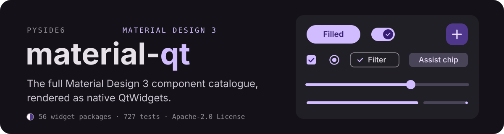
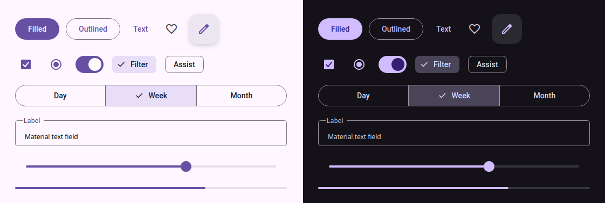
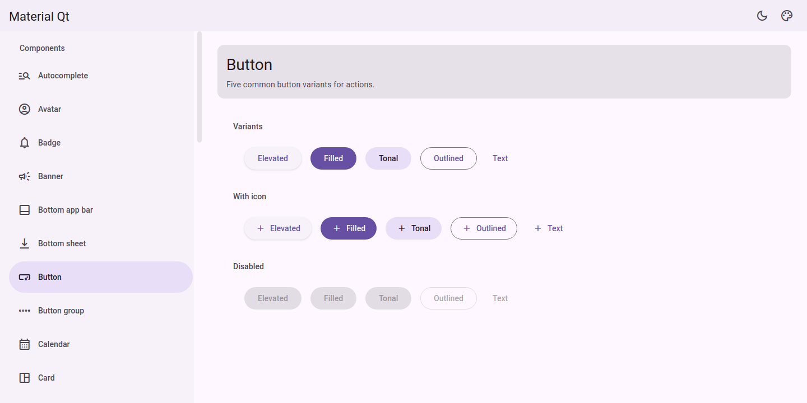

<p align="center">
  
</p>

<p align="center">
  
</p>
<p align="center"><sub>Real output, not a mockup. The same widgets grabbed from one app in light and dark mode.</sub></p>

**material-qt** brings [Material Design 3](https://m3.material.io/) to
Python desktop apps as plain QtWidgets. No QML, no stylesheets to fight.
Every component is painted from the upstream
[Material Web](https://github.com/material-components/material-web) design
tokens (transcribed, not approximated), with real ripples, state layers,
elevation shadows, focus rings, and motion curves.
[Flutter's Material library](https://api.flutter.dev/flutter/material/material-library.html)
is the parity reference for behavior.

## Quick start

```bash
pip install -e ".[dev]"
python -m material_qt.gallery      # browse every component
```

```python
from PySide6.QtWidgets import QApplication
from material_qt.theme.theme_manager import ThemeManager, ThemeMode
from material_qt.widgets.button import MdFilledButton

app = QApplication([])
ThemeManager.instance().set_mode(ThemeMode.SYSTEM)  # light / dark / system
btn = MdFilledButton("Hello Material")
btn.show()
app.exec()
```

Theming is one call: every widget repaints on `ThemeManager.themeChanged`
mode switches, brand palettes (`set_palette`), and per-role overrides
(`set_overrides`) apply live to a running app.

## The gallery

Every component has a page with its variants and states, it doubles as the
visual regression surface for the test suite.

<p align="center">
  
</p>

## What's inside

| Package | Contents |
| --- | --- |
| `material_qt.widgets` | 56 component packages, buttons, text fields, dialogs, sheets, pickers, data table, navigation, and the rest of the M3 catalogue |
| `material_qt.core` | The shared machinery: ripple, state layer, focus ring, elevation, motion, shape, modal overlay |
| `material_qt.theme` | `ColorScheme` role -> color maps, `ThemeManager` (light/dark/system, palettes, overrides) |
| `material_qt.tokens` | Pure-Python design tokens generated from the upstream SCSS, no Qt imports |

## Tests

```bash
QT_QPA_PLATFORM=offscreen python -m pytest
```

Without an editable install, prefix `PYTHONPATH=src`.

## Adding a widget

A new component is: a module under `src/material_qt/widgets/<name>/`, exports
in its `__init__.py`, tests under `tests/widgets/<name>/`, and three gallery
edits in `src/material_qt/gallery/gallery.py`, the import, a `_build_<name>`
function, and alphabetical entries in `_COMPONENTS` and `COMPONENT_META`.

## License

[Apache-2.0](./LICENSE)
